# GamePadHelper

**Version:** 1.06 · **Authors:** olegbl, quelron · **API:** 101049

A collection of UI improvements and quality-of-life enhancements for Elder Scrolls Online, designed for gamepad play but compatible with keyboard & mouse too. Every feature can be toggled individually from the in-game settings panel. 

Price data provided by **Tamriel Savings Co** when TSC sources are available.

---

## Table of Contents

- [Installation](#installation)
- [Settings](#settings)
- [Features](#features)
  - [Fishing](#fishing)
  - [Auto Repair](#auto-repair)
  - [Auto Weapon Charge](#auto-weapon-charge)
  - [Antiquarian's Eye](#antiquarians-eye)
  - [Teleporter](#teleporter)
  - [Dungeon Finder](#dungeon-finder)
  - [Provisioning](#provisioning)
  - [Gear Comparison](#gear-comparison)
  - [Inventory Covetous Countess](#inventory-covetous-countess)
  - [Inventory Trait](#inventory-trait)
  - [Loot Offset](#loot-offset)
  - [Overview Panel](#overview-panel)
  - [Tooltip Enchantment](#tooltip-enchantment)
  - [Tooltip Font](#tooltip-font)
  - [Tooltip Poison](#tooltip-poison)
  - [Tooltip Price](#tooltip-price)
  - [Tooltip Trait](#tooltip-trait)
- [Dependencies](#dependencies)
- [Support](#support)

---

## Installation

1. Download and extract the archive into your AddOns folder:
   ```
   Documents\Elder Scrolls Online\live\AddOns\GamePadHelper\
   ```
2. Install all required dependencies listed in [Dependencies](#dependencies).
3. Launch ESO and enable **GamePadHelper** in the AddOn Manager.

---

## Settings

All features can be toggled without reloading the UI. Open the settings panel via:

- **Keyboard / Mouse** — `ESC → Settings → AddOns → GamePadHelper`
- **Gamepad** — `Menu → Options → Extensions → GamePadHelper`

---

## Features

### Fishing

Enhances the fishing experience for gamepad users with three improvements:

- **Controller vibration** pulses when a fish bites.
- **"Reel in!" alert** appears on screen so you don't miss a catch.
- **Automatic bait selection** picks the correct bait for the current fishing hole type (foul, saltwater, lake, river). Falls back to alternative baits (Minnow/Guts, Chub/Worms) when the primary bait is unavailable.

---

### Auto Repair

Automatically repairs all equipped items when you open any merchant store, as long as repair is available and costs gold. No more forgetting to repair between combat sessions.

---

### Auto Weapon Charge

Automatically recharges equipped weapons (main hand, off hand, backup main, backup off) using the highest-level filled soul gem available when charge drops below **25%** after leaving combat.

---

### Antiquarian's Eye

Automatically slots and activates the **Antiquarian's Eye** collectible when you are not in combat and not moving, then unslots it when it would be blocked. Removes the need to manually manage the collectible slot while scrying.

---

### Teleporter

| Screenshot | Screenshot |
|---|---|
| 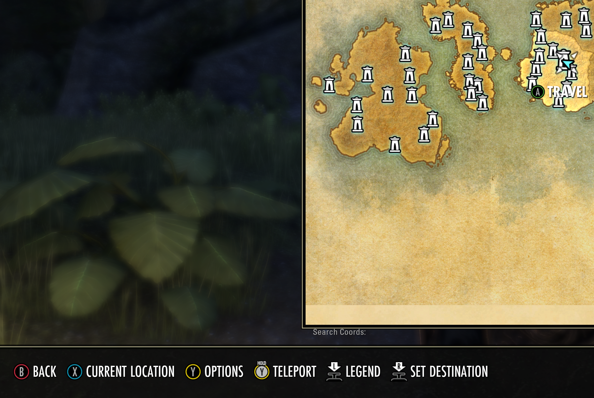 | 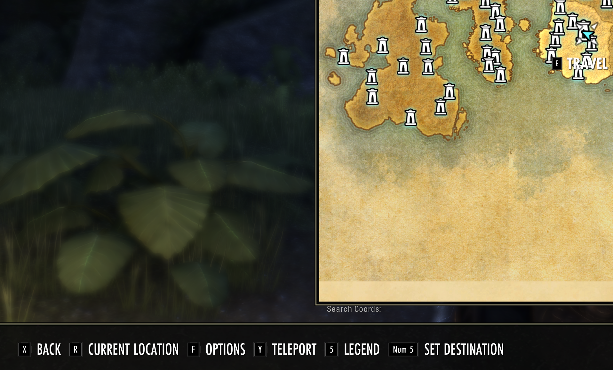 |
| 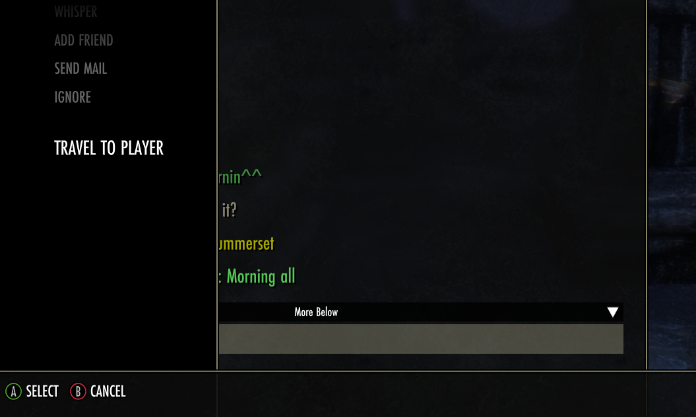 | |

Two teleport improvements:

- **World Map hotkey** — while hovering a zone on the world map, a new hotkey lets you instantly ask BeamMeUp to teleport to that zone using the best available method. Especially useful on gamepad where BeamMeUp's normal interface is hard to reach.
- **Chat "Jump to Player"** — adds jump options to the chat context menu for friends, guild members, and group members.

> Requires **BeamMeUp** (optional) for the teleport functionality.

---

### Dungeon Finder

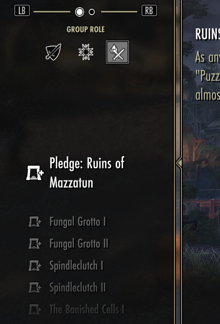

Replaces dungeon names in the Dungeon Finder list with their corresponding **pledge quest names**, making it much easier to identify which dungeon completes your daily pledge without cross-referencing.

---

### Provisioning

Adds a filter to hide **low-level recipes (below CP160)** in the provisioning interface. Keeps the recipe list clean and focused on relevant recipes for end-game characters.

---

### Gear Comparison


When toggling between a preview of your currently equipped item and a new item's stat changes, both panels are shown **side-by-side** simultaneously, making it easy to compare at a glance without toggling back and forth.

---

### Inventory Covetous Countess

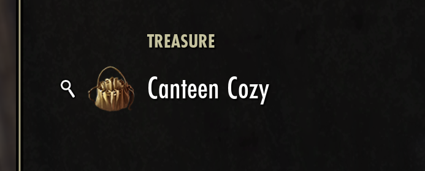

Adds a magnifying glass icon next to treasures in your inventory that are relevant to the **Covetous Countess** quest:

- **Green icon** — item is useful for your currently active Covetous Countess quest step.
- **White icon** — item is useful for the quest but not the current active step.

---

### Inventory Trait

| Screenshot | Screenshot | Screenshot |
|---|---|---|
| 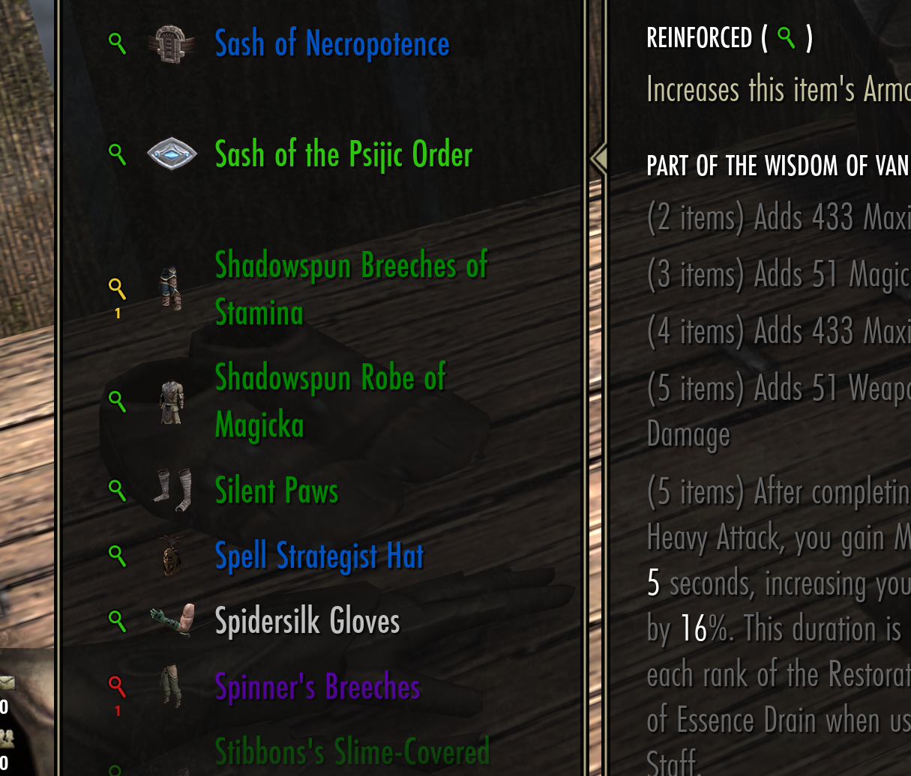 | 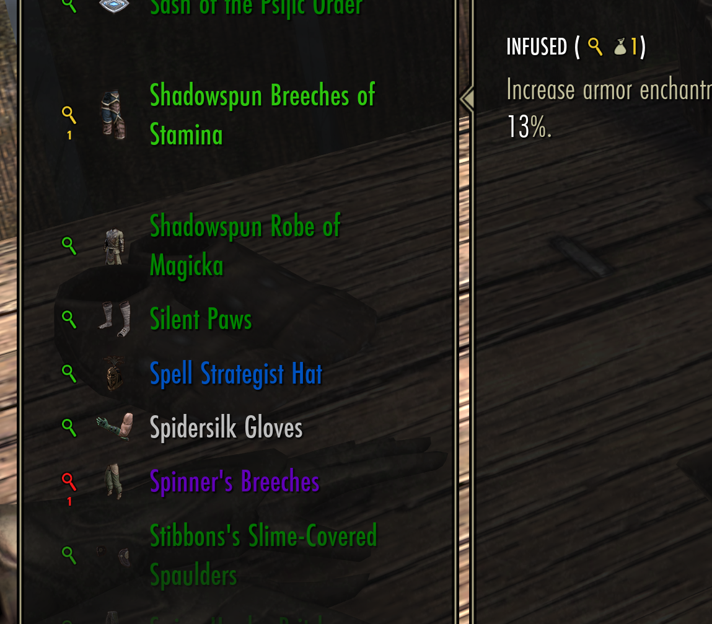 | 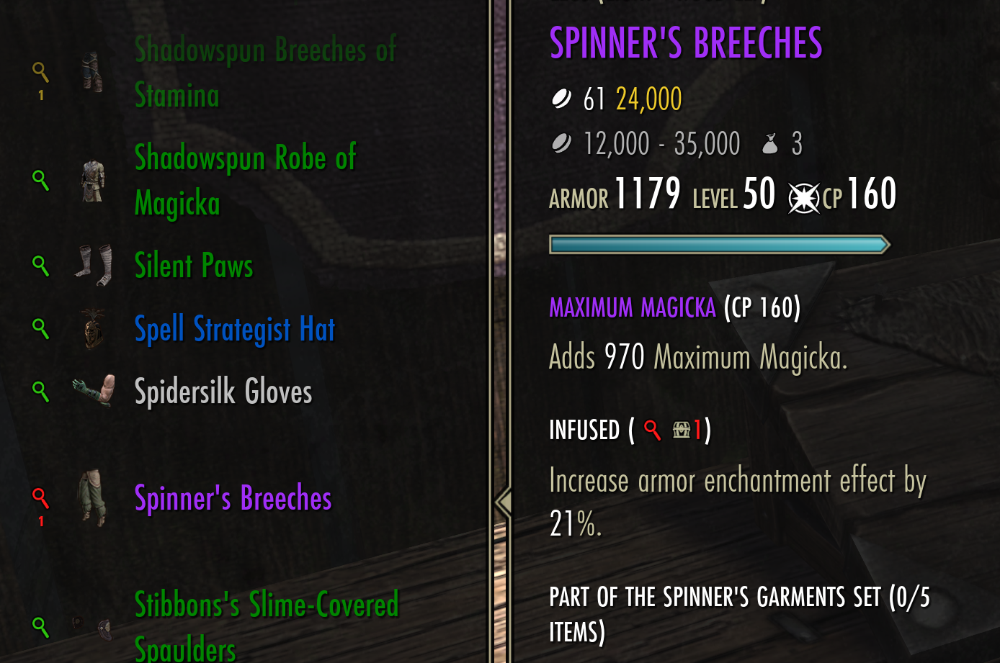 |

Shows a magnifying glass icon next to items whose trait can be **researched by the current character**, with color coding to indicate duplicates:

| Icon | Meaning |
|---|---|
| 🟢 Green | Only copy with this trait you have access to — safe to research |
| 🟡 Yellow | Another copy with the same trait exists in your **inventory** |
| 🔴 Red | Another copy with the same trait exists in your **bank** |

Numbers below the icon show exactly how many duplicate copies exist (yellow = inventory, red = bank). Locked items show an icon but are excluded from duplicate counting. Other account characters are not considered.

---

### Loot Offset

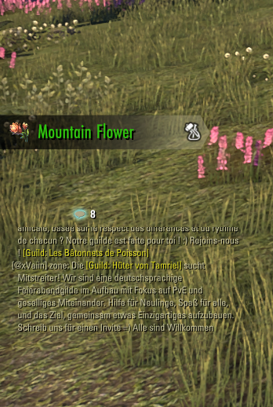

Shifts the **loot history panel** upward so it does not overlap the chat box for keyboard/mouse users. The offset amount is configurable (default: 350 px).

> Requires a UI reload after toggling.

---

### Overview Panel

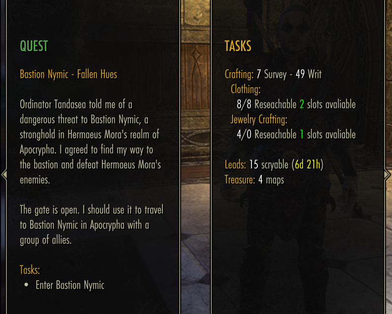

Adds a rich overview panel at the root menu with two columns:

**Left — Quest Details**
- Quest background, active step, tasks, completed tasks, optional steps, and hints.

**Right — Daily Reminders**
- Horse training availability
- Crafting research slots and researchable traits/items per craft
- Surveys and writs counts
- Antiquities scryable leads with expiration timers
- Treasure map count

---

### Tooltip Enchantment

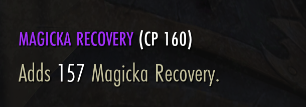

Reformats the **enchantment information** in item tooltips for improved readability.

---

### Tooltip Font

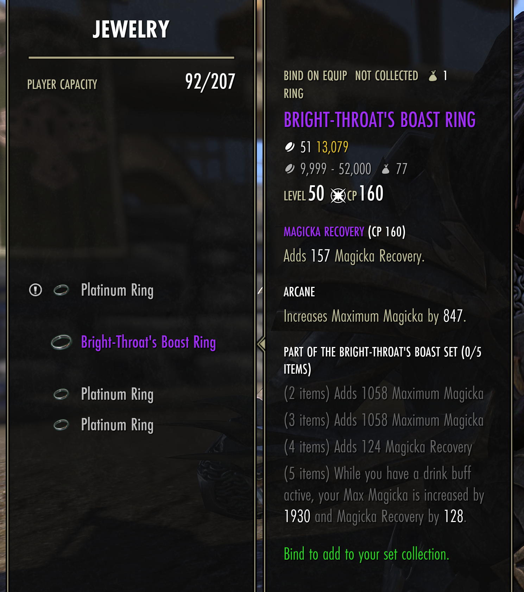

Applies a cleaner font to **item tooltips**, optimized for readability on both gamepad (TV distance) and keyboard (monitor distance).

---

### Tooltip Poison

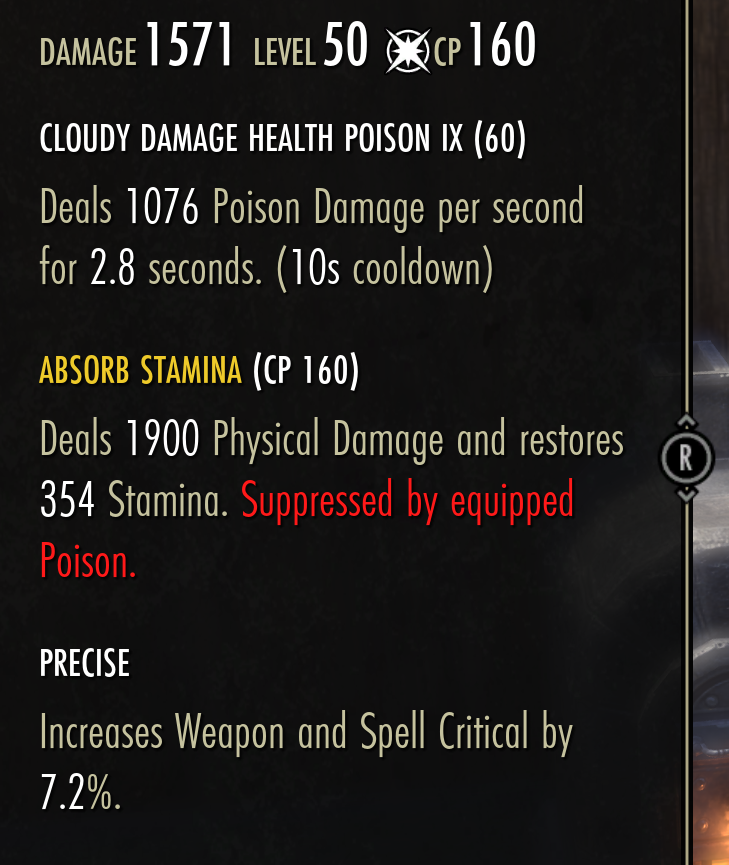

Reformats **applied poison information** in item tooltips for improved readability.

---

### Tooltip Price

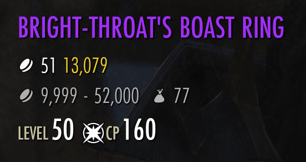

Reformats the **price information** in item tooltips. When a supported market addon is installed (for example **TamrielTradeCentre** or console price providers), also shows market pricing data inline.

Price data provided by **Tamriel Savings Co** when TSC sources are available.

---

### Tooltip Trait

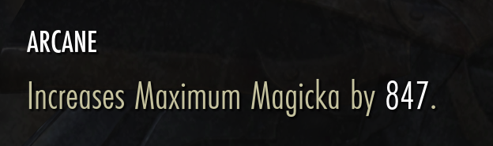

Reformats **trait information** in item tooltips. Uses the same color coding as [Inventory Trait](#inventory-trait) to indicate research status at a glance.

---

## Dependencies

### Required

These must be installed for GamePadHelper to load. All are available on both PC and console.

| Library | What it does |
|---|---|
| [LibCovetousCountess](https://www.esoui.com/downloads/info3266-LibCovetousCountess.html) | Supplies quest-step data used by the **Inventory Covetous Countess** feature to identify which treasures are relevant to your active quest step. |
| [LibItemLinkDecoder](https://www.esoui.com/downloads/info3265-LibItemLinkDecoder.html) | Decodes raw item link data used by **Tooltip Enchantment** to reformat enchantment information in item tooltips. |
| [LibTraitResearch](https://www.esoui.com/downloads/info3264-LibTraitResearch.html) | Tracks per-character trait research progress, powering both the **Inventory Trait** icons and the **Tooltip Trait** color coding. |
| [LibMultiIcon](https://www.esoui.com/downloads/info3267-LibMultiIcon.html) | Renders stacked icon overlays on inventory slots, used by **Inventory Trait** and **Inventory Covetous Countess** to display their indicator icons without conflicting with each other. |

### Optional

These are not required to load the addon. Each one unlocks or enhances a specific feature.

| Library / Addon | What it unlocks |
|---|---|
| [BeamMeUp](https://www.esoui.com/downloads/info2143-BeamMeUp-TeleporterFastTravel.html) | Powers the **Teleporter** feature — the world map zone hotkey and the chat "Jump to Player" options both call BeamMeUp to perform the actual travel. Without it the Teleporter feature does nothing. |
| [TamrielTradeCentre](https://www.esoui.com/downloads/info1245-TamrielTradeCentre.html) | Optional market source for **Tooltip Price**. |
| TSC Price Data API (`TSCPriceDataAPIXBNA`, `TSCPriceDataAPIPSNA`, `TSCPriceDataAPIXBEU`, `TSCPriceDataAPIPSEU`) | Optional console market data source for **Tooltip Price**. |

Attribution: Price data provided by **Tamriel Savings Co** when available.

---

## Support

This addon is provided as-is, without warranty or support of any kind. Bug reports and contributions are welcome via the [GitHub repository](https://github.com/olegbl/eso-mods/tree/main/GamePadHelper).
